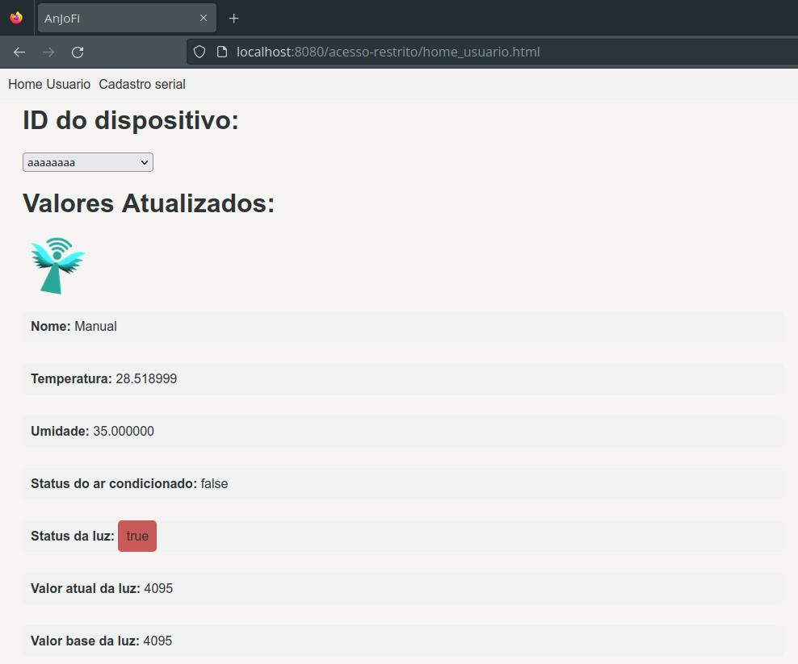
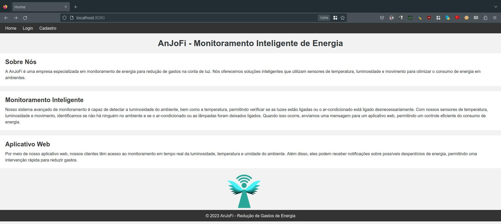
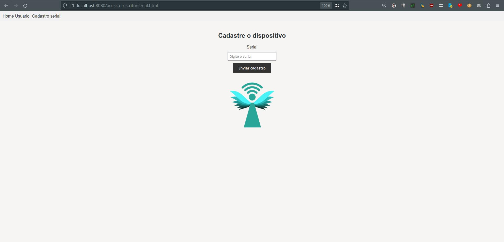

# Backend

Este repositório contém o código backend de um aplicativo que lida com operações relacionadas a usuários e autenticação. O código está escrito em Java e utiliza o framework Spring.

## Funcionalidades

O código possui as seguintes funcionalidades:

## Classe `Arduino`

A classe `Arduino` é utilizada para representar um dispositivo Arduino e obter seu status, com os seguintes atributos:

- `temperatura`: uma string que armazena a temperatura do dispositivo.
- `umidade`: uma string que armazena a umidade do dispositivo.
- `estado`: uma string que armazena o estado do dispositivo.
- `lampada`: uma string que armazena o estado da lâmpada do dispositivo.

A classe possui um construtor com os métodos a seguir:

- `statusDispositivo()`: retorna um objeto do tipo `HashMap<String, String>` contendo o status do dispositivo, com as chaves "Temperatura" e "Umidade" e seus respectivos valores.
- `toString()`: retorna uma string que representa o objeto `Arduino`, exibindo os valores dos atributos `temperatura`, `umidade`, `estado` e `lampada`.

## Classe `Dispositivo`

A classe `Dispositivo` é um controlador REST que gerencia com as requisições relacionadas aos dispositivos. Ela possui a seguinte estrutura:

- `@RestController`: uma anotação que marca a classe como um controlador REST, permitindo que ela receba e responda a requisições HTTP.
- `@RequestMapping("/dispositivos")`: uma anotação que especifica o caminho base para as rotas definidas no controlador.

Essa classe é utilizada como um ponto de entrada para gerenciar requisições relacionadas aos dispositivos, como obter informações ou controlar suas funcionalidades.

## Classe `Iniciar`

A classe `Iniciar` é um controlador REST responsável pela comunicação MQTT. Ela instancia a classe MQTT e cuida das requisições referente aos dados dos sensores. O construtor da classe ficou da seguinte forma:

```
public Iniciar(@Value("${mqtt.server}") String server, @Value("${mqtt.port}") String port, @Value("${mqtt.user}") String user, @Value("${mqtt.password}") String password)
```

As anotações `@Value("${variavel}")` fazem com que valores externos sejam injetados nas *Strings*  "server", "port", "user" e "password". Elas são obtidas a partir do arquivo "application.properties" ou por argumento de linha de comando, que será explicado posteriormente.

 - Método `conectar()`: Dispara uma *thread* que se inscreve em um tópico e ficará esperando por mensagens vindas do MQTT.
 - Método `getLastReceivedData(@PathVariable String id)`: é chamado quando `/iniciar/{id}/last` é invocado via REST, e retorna o último dado enviado por um dispositivo especificado em `{id}`.
 - Método `listAllDevices()`: é chamado quando `/iniciar` é invocado via REST e retorna um vetor JSON com todos os dispositivos que já tenham enviado mensagens.

## Classe `LoginController`

A classe `LoginController` é um controlador REST que lida com as operações de autenticação de usuários. Ela possui um endpoint POST em `/login` que recebe um objeto `Usuario` no corpo da requisição. A senha fornecida é criptografada e comparada com a senha armazenada no ID de usuário correspondente. Se as senhas coincidirem, uma resposta HTTP 200 OK é retornada. Caso contrário, uma resposta HTTP 404 Not Found é retornada.

## Classe `UsuarioController`

A classe `UsuarioController` é um controlador REST que lida com operações de criação, leitura, atualização e exclusão de usuários. Ela possui os seguintes endpoints:

- `GET /usuarios`: Retorna todos os usuários cadastrados em formato JSON.
- `GET /usuarios/{id}`: Retorna um usuário específico com base no ID fornecido em formato JSON.
- `POST /usuarios`: Adiciona um novo usuário com base nos dados fornecidos no corpo da requisição.
- `PUT /usuarios/{id}`: Atualiza os dados de um usuário específico com base no ID fornecido.
- `DELETE /usuarios/{id}`: Exclui um usuário específico com base no ID fornecido.

## Classe `Operacao`

A classe `Operacao` contém os métodos auxiliares para manipulação e persistência de usuários. Ela possui os seguintes métodos:

- `iniciar()`: Carrega os usuários do arquivo para a memória.
- `adicionarUsuario(Usuario usuario)`: Adiciona um novo usuário à lista de usuários, verificando se já existe um usuário com o mesmo ID.
- `exibirUsuarios()`: Retorna todos os usuários cadastrados.
- `salvarUsuariosNoArquivo()`: Salva os usuários no arquivo.
- `validarSenha(String id, String senha)`: Valida a senha fornecida por um usuário com a senha armazenada para o ID correspondente.
- `exibirUsuario(String id)`: Retorna um usuário específico com base no ID fornecido.
- `excluirUsuario(String id)`: Exclui um usuário com base no ID fornecido.
- `atualizarArquivo()`: Atualiza o arquivo de usuários após exclusão de um usuário.
- `criptografar(String texto)`: Criptografa um texto usando o algoritmo SHA-256.

## Classe `Usuario`

A classe `Usuario` representa a entidade de um usuário do sistema, com métodos para criptografar e validar a senha. Os atributos armazenam informações básicas do usuário, como ID, nome, email e senha, sendo a senha criptografada para fins de segurança. Ela possui os seguintes atributos:

- `id`: uma string que representa o identificador único do usuário.
- `nome`: uma string que armazena o nome do usuário.
- `email`: uma string que contém o email do usuário, criptografado utilizando o algoritmo SHA-256.
- `senha`: uma string que armazena a senha do usuário, também criptografada utilizando o algoritmo SHA-256.

A classe possui os seguintes métodos:

- `Usuario()`: construtor.
- `Usuario(String id, String nome, String email, String senha)`: construtor que recebe os parâmetros `id`, `nome`, `email` e `senha` para inicializar os atributos correspondentes.
- `getId()`: método que retorna o ID do usuário.
- `getNome()`: método que retorna o nome do usuário.
- `getEmail()`: método que retorna o email do usuário (descriptografado).
- `getSenha()`: método que retorna a senha do usuário (descriptografada).
- `criptografar(String texto)`: método que recebe uma string `texto` e retorna uma versão criptografada dessa string usando o algoritmo SHA-256.
- `descriptografar(String textoCriptografado)`: método que recebe uma string `textoCriptografado` e retorna a versão descriptografada dessa string.
- `validarSenha(String senha2)`: método que recebe uma string `senha2` e verifica se ela corresponde à senha do usuário. Retorna `true` se a senha for válida e `false` caso contrário.


## Classe `UsuarioExistenteException`

A classe `UsuarioExistenteException` é uma exceção personalizada enviada quando ocorre uma tentativa de adicionar um usuário que já existe. Ela herda da classe `RuntimeException` do Java.

Essa classe possui um construtor que recebe um objeto `Usuario` como parâmetro e utiliza o método `super()` para chamar o construtor da classe pai (`RuntimeException`). O construtor da exceção cria uma mensagem de erro informando que já existe um usuário com as informações fornecidas.


## Classe `UsuarioNaoEncontradoException`

A classe `UsuarioNaoEncontradoException` é uma exceção enviada quando ocorre uma tentativa de obter um usuário inexistente. Ela herda a classe `RuntimeException` do Java.

Essa classe possui um construtor que recebe uma String `id` como parâmetro e utiliza o método `super()` para chamar o construtor da classe pai (`RuntimeException`). O construtor da exceção cria uma mensagem de erro informando que não foi possível encontrar um usuário com a ID fornecida.


## Classe `AnjofiMqtt`

A classe `AnjofiMqtt` é responsável por gerenciar a conexão MQTT e a troca de mensagens entre um cliente MQTT e um servidor MQTT. As principais características e métodos da classe são:

- Atributos:
  - `server`: uma String que representa o endereço do servidor MQTT.
  - `port`: um inteiro que representa a porta do servidor MQTT.
  - `identifier`: uma String que identifica o cliente MQTT.
  - `lastReceivedData`: uma String que armazena a última mensagem recebida pelo cliente MQTT.
  - `lastDevice`: uma String que armazena o último dispositivo associado à mensagem recebida.
  - `topicAndMessage`: uma String que armazena o tópico e a mensagem recebida formatados como "dispositivo:mensagem".
  - `client`: um objeto da classe `MqttClient` que representa o cliente MQTT.
  - `receivedMessages`: uma tabela *hash* que contém os dados recbidos via MQTT. Nela, são armazenados o identificador do dispositivo e o contéudo recebido. A chave é uma *String* e o valor é um vetor de *String*. Dessa forma, há o histórico de dados recebidos por dispositivo.

- Construtores:
  - `AnjofiMqtt(String server, int port, String identifier)`: construtor que recebe o endereço do servidor MQTT, a porta e o identificador do cliente MQTT. Ele estabelece uma conexão MQTT com o servidor.
  - `AnjofiMqtt(String server, int port, String user, String password, String identifier)`: construtor que recebe o endereço do servidor MQTT, a porta, o nome de usuário, a senha e o identificador do cliente MQTT. Ele estabelece uma conexão MQTT com o servidor, autenticando-se com as credenciais fornecidas.

- Métodos:
  - `listen(String topic)`: configura o cliente MQTT para escutar um determinado tópico. Ele se inscreve no tópico fornecido e define um callback para lidar com as mensagens recebidas.
  - `getLastReceivedData()`: retorna a última mensagem recebida pelo cliente MQTT como uma String.
  - `getLastDevice()`: retorna o identificador do último dispositivo cuja mensagem foi recebida pelo servidor.
  - `getAllDevices()`: Obtém um vetor JSON com todos os dispositivos cujo servidor recebeu as mensagens.
  - `storeNewMessage(String deviceID, String message)`: armazena a mensagem recebida no vetor de *String* referente ao dispositivo de origem.

A classe `AnjofiMqtt` permite que você estabeleça uma conexão MQTT, escute os tópicos desejados e acesse as últimas mensagens recebidas, além de armazená-las todas de acordo com o subtópico informado.

## Classe `BackendApplication`

- Atributos

Os atributos têm a anotção `@Value("${variavel}")`, que injeta os valores declarados no arquivo `application.properties`, localizado em `src/main/resources/application.properties`. Além disso, são todos estáticos, que os permitem serem acessados diretamente fora da clase. Abaixo, está a especificação de cada um:

  - `mqttServer`: *String* que contém o endereço do servidor MQTT;
  - `mqttPort`: *String* que contém a porta do servidor MQTT;
  - `mqttUser`: *String* que armazena o usuário para autenticar-se no servidor MQTT;
  - `mqttPassword`: *String* que armazena a porta do servidor MQTT;

A classe `BackendApplication` é a classe principal da aplicação Spring Boot. Ela contém o método `main` que é o ponto de entrada para iniciar a aplicação.

Principais características:

- `@SpringBootApplication`: Essa anotação marca a classe como uma classe de aplicação Spring Boot e configura automaticamente a aplicação.

- `main`: o método `main` é o ponto de entrada da aplicação. Ele inicia a aplicação Spring Boot chamando o método estático `run` da classe `SpringApplication`. O método `run` inicia a aplicação e realiza a configuração necessária para executar a aplicação.

- `throws MqttException`: a declaração `throws MqttException` no método `main` indica que o método pode lançar uma exceção do tipo `MqttException`. Essa exceção é lançada quando ocorre algum erro relacionado à biblioteca Eclipse Paho MQTT durante a execução da aplicação.

- Método `run`

De forma que se flexibilize a instanciação do servidor, foi implementada uma lógica simples para sobrescrever as variáveis definidas no arquivo `application.properties` através de argumentos de linha de comando. Dessa forma quaisquer um dos quatro atributos referentes ao servidor MQTT podem ser sobrescritos no momento da execução do servidor.

## Dependências

O código depende das seguintes bibliotecas:

- `org.eclipse.paho.client.mqttv3`: Biblioteca para comunicação MQTT.
- `org.springframework`: Bibliotecas para o desenvolvimento de aplicativos web utilizando o framework Spring.

## Execução do servidor

### Pré-requisitos

 - Java Runtime Environment 17 ou superior;
 - Gradle 8 ou superior;
 - Servidor MQTT acessível a partir do sistema em que o servidor será executado.

### Eclipse Mosquitto

Para este projeto foi utilizado o servidor MQTT Eclipse Mosquitto, que pode ser instanciado utilizando o Docker ou Podman. No exemplo abaixo é utilizado o Docker. Para tal, primeiramente, prepara-se o ambiente, criando um diretório de trabalho:

```
mkdir -p $HOME/conteineres/mosquitto/{config,log,data}
```

O arquivo de configuração, localizado em `$HOME/conteineres/mosquitto/config/mosquitto.conf`. Utilize os seguintes parâmetros:

```
listener 1883
persistence true
persistence_location /mosquitto/data/
log_dest file /mosquitto/log/mosquitto.log
password_file /mosquitto/config/password
log_type all
```

Nota-se o uso do arquivo de credenciais `$HOME/conteineres/mosquitto/config/password` que contém o conteúdo abaixo:

```
anjofi:$7$101$sP1TAVD6P44A92Q2$Y8ekZCTW0d3OtBs0puPxlmLghrKIbC97YWdCQkoLsdrXuItuR7oPPqu6goQb/K33dq9YSPxm5y1KFq0L6iFu4Q==
```

Por fim, instancia-se o servidor:

```
docker run -it --name mosquitto -p 1883:1883 -p 9001:9001 -v $HOME/conteineres/mosquitto:/mosquitto eclipse-mosquitto
```

### Execução do projeto Gradle

1. Clone este repositório:

```
git clone https://github.com/ifsc-arliones/ifsc-pji2-2023-1-anjofi.git
```

2. Entre no diretório clonado:

```
cd ifsc-pji2-2023-1-anjofi/backend
```

3. O servidor pode ser instanciado das seguintes formas:
  
     - Com os valores padrões: 
  
      ```
      gradle bootRun
      ```

     - Com argumento de linha de comando que sobrescreve o valores referentes ao servidor MQTT:

      ```
      gradle bootRun --args="--mqtt.server=localhost --mqtt.port=1883 --mqtt.user=anjofi --mqtt.password=pji29006"
      ```

      Apenas os valores especificados serão sobrescritos.

      Valores padrões especificados no arquivo [`application.properties`](src/main/resources/application.properties):
      - mqtt.server: localhost
      - mqtt.port: 1883
      - mqtt.user: anjofi
      - mqtt.password: pji29006

4. A página *web* pode ser acessada pelo endereço abaixo:

  ```
  http://localhost:8080
  ```

## Testes

De forma que se consiga avaliar o comportamento do servidor com valores, é possível simular o envio de dados via MQTT, utilizando a aplicação `mosquitto_pub`, conforme mostrado no exemplo abaixo:

```
mosquitto_pub -h jpmsb.ddns.net -p 51439 -m "{\"name\":\"Manual\", \"temperature\":\"28.518999\", \"humidity\":\"35.000000\", \"acStatus\":\"false\", \"lightStatus\":\"true\", \"lightCurrentValue\":\"4095\", \"lightBaseValue\":\"4095\"}" -t "AnJoFi/aaaaaaaa" -u anjofi -P pji29006
```

Dessa forma, é possível simular diferentes dispositivos, bem como variar os valores:

 - Nome
 - Temperatura
 - Umidade
 - Status do ar-condicionado
 - Status da luz
 - Valor atual da luz
 - Valor base da luz

## Páginas do servidor

 - Página do usuário após login


O dispositivo pode ser selecionado através do menu em cascata e é atualizado imediatamente. O período de atualização da página é de 2 segundos.

 - Página inicial



- Página de login


- Página de cadastro


- Página de cadastro de serial
  
